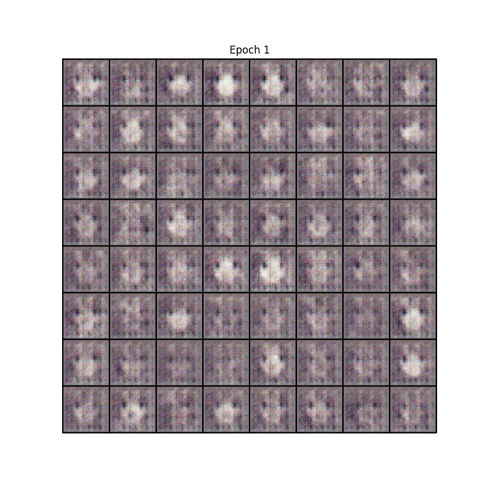
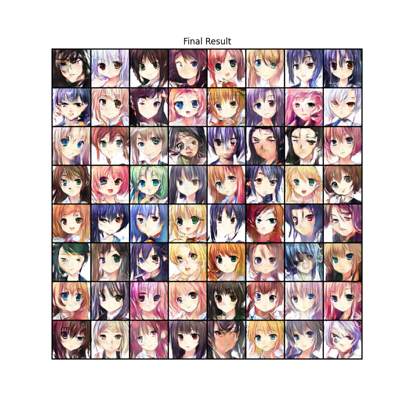
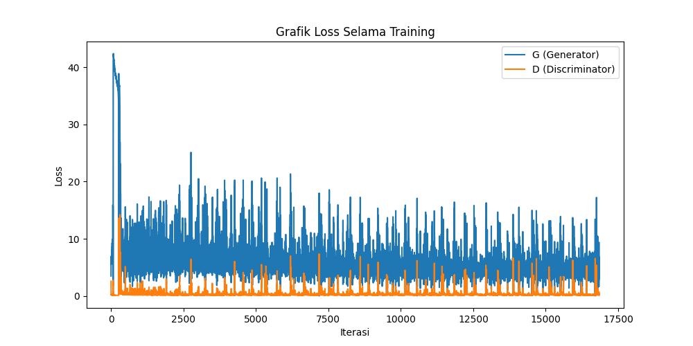

# Anime Face Generation using DCGAN

Repository ini berisi implementasi **Deep Convolutional Generative Adversarial Networks (DCGAN)** untuk men-generate wajah karakter anime. Proyek ini dibuat sebagai **Final Project** mata kuliah Kecerdasan Buatan (Artificial Intelligence).

Model dilatih menggunakan dataset wajah anime berukuran **64x64 pixel** untuk mempelajari distribusi data dan menghasilkan gambar sintetik baru yang belum pernah ada sebelumnya.

## 📋 Deskripsi Project

Tujuan utama proyek ini adalah membangun model generatif yang stabil menggunakan arsitektur DCGAN standar (berdasarkan paper *Radford et al.*).

**Fitur & Spesifikasi Teknis:**
* **Generator:** Menggunakan *Transposed Convolution* untuk upsampling dari noise vector (100) menjadi gambar RGB (64x64).
* **Discriminator:** Menggunakan CNN standar dengan LeakyReLU untuk klasifikasi biner (Real vs Fake).
* **Optimasi (Fine-Tuned):** Menggunakan **Adam Optimizer** dengan strategi *Split Learning Rate* untuk menjaga dominasi Discriminator di angka optimal (~80%):
    * **Learning Rate Discriminator:** `0.0002` (Standar)
    * **Learning Rate Generator:** `0.0001` (Diperlambat agar Discriminator lebih akurat).
* **Stabilitas Training:** Menerapkan teknik **Label Smoothing** (target label **0.98**) pada Discriminator.

## 📂 Dataset

Dataset yang digunakan adalah kumpulan wajah anime yang telah di-crop dan dibersihkan.
* **Sumber:** [Kaggle - Anime Faces](https://www.kaggle.com/datasets/soumikrakshit/anime-faces)
* **Resolusi Input:** 64x64 pixel
* **Format:** RGB
* **Preprocessing:** Normalisasi ke range `[-1, 1]` sesuai standar aktivasi Tanh pada output Generator.

## 📊 Hasil Training (Results)

Berikut adalah perbandingan hasil generate model dari awal hingga akhir training:

| Epoch 1 (Awal) | Epoch 50 (Final) |
| :---: | :---: |
|  |  |
*(Gambar di atas adalah hasil generate murni dari model)*

### Grafik Loss & Analisis


> **Analisis Hasil:**
> Dengan menerapkan strategi penurunan *Learning Rate* pada Generator menjadi `0.0001` dan *Label Smoothing* `0.93`, model berhasil mencapai titik konvergensi yang sehat.
> * **Akurasi Discriminator:** Terjaga stabil di rentang **80% - 82%**.
> * **Kualitas Citra:** Discriminator yang cukup kuat memaksa Generator untuk menghasilkan detail wajah yang lebih tajam dan struktur mata yang jelas, menghindari masalah gambar *blur* yang sering terjadi jika Discriminator terlalu lemah.

## 🛠️ Requirements & Instalasi

Project ini dikembangkan menggunakan Python 3.10 di lingkungan Windows dengan dukungan GPU (CUDA).

### Cara Instalasi

1.  **Clone repository ini:**
    ```bash
    git clone [https://github.com/bagoongyoo/Artificial_Intellegence.git](https://github.com/bagoongyoo/Artificial_Intellegence.git)
    cd Artificial_Intellegence
    ```

2.  **Buat Virtual Environment (Opsional tapi Recommended):**
    ```bash
    python -m venv .venv
    # Windows:
    .\.venv\Scripts\activate
    ```

3.  **Install Dependencies:**
    Jalankan perintah berikut untuk menginstall library yang dibutuhkan:
    ```bash
    pip install -r requirements.txt
    ```
    *(Pastikan file `requirements.txt` sudah ada di folder project)*

## 🚀 Cara Menjalankan

1.  Pastikan file dataset `anime_faces.zip` sudah berada di dalam folder project (dan diekstrak sesuai path di notebook).
2.  Buka file notebook **`DCGAN_Anime.ipynb`** menggunakan VS Code atau Jupyter Notebook.
3.  Pastikan kernel yang dipilih adalah `.venv`.
4.  Jalankan cell secara berurutan (*Run All*).

**Catatan Khusus Pengguna Windows:**
Pada konfigurasi `DataLoader`, parameter `num_workers` diset ke `0` untuk menghindari error *BrokenPipe* atau *Multiprocessing* yang umum terjadi pada OS Windows.
```python
workers = 0